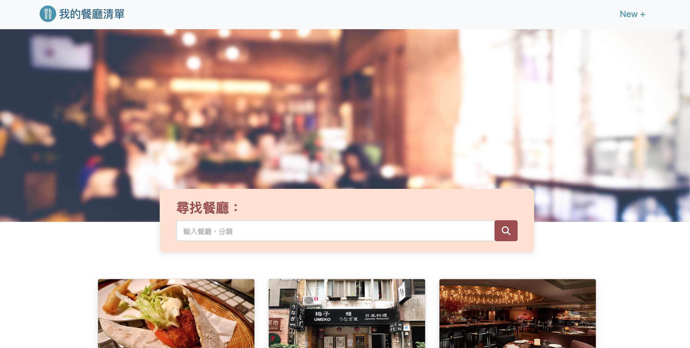

# Restaurant List



## Introduction

A simple restaurant list built by Node.js, Express and MongoDB

## Features

* Users can see all restaurants' brief info on the index page
* Users can click the restaurant to enter the show page for more detail
* Users can find specific restaurants by searching name or category
* Users can add new restaurants
* Users can modify restaurant info
* Users can delete restaurants

## Environment Setup
Please install Node.js and npm before starting; make sure you already have a MongoDB account

## How to Use

1. Clone the project to local side
2. Access the project directory through terminal, then type in:

   ```bash
   npm install
   ```

3. Once installed, set environment variable to get access to your MongoDB

   ```bash
   MONGODB_URI="Your MongoDB Account Connection String"
   ```

4. To get seed data, use this command

   ```bash
   npm run seed
   ```

5. Then type in:

   ```bash
   npm run start
   ```

6. You'll see below message in console. Now open your browser and enter URL to see the restaurant list.

   ```bash
   Express is listening on http://localhost:3000
   ```

7. To stop the server:

   ```bash
   ctrl + c
   ```


