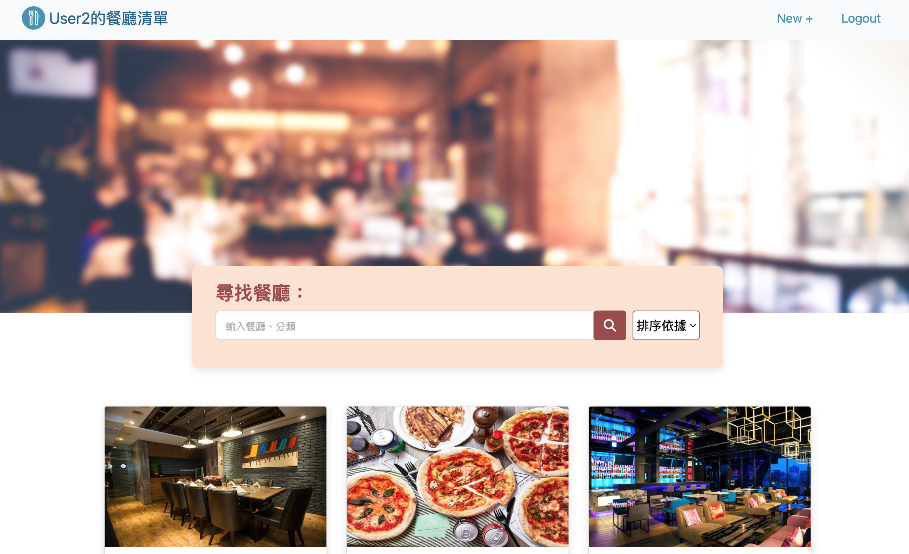
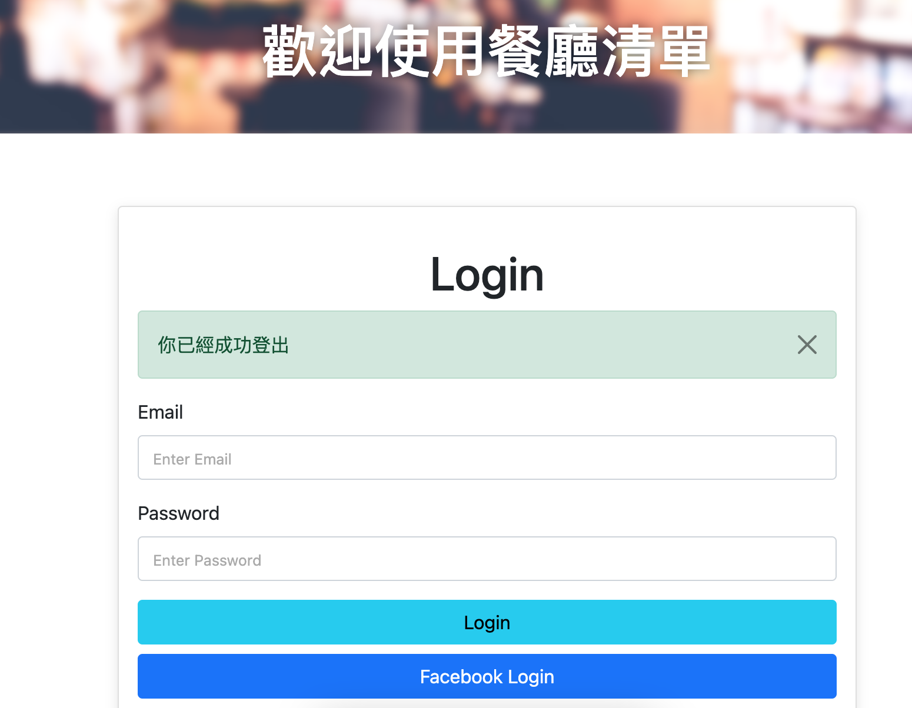

# Restaurant List




## Introduction

A simple restaurant list built by Node.js, Express and MongoDB

## Features
* Users can register an account to create their own restaurant list
* Users can login via Facebook
* Users can see all restaurants' brief info on the index page
* Users can click the restaurant to enter the show page for more detail
* Users can find specific restaurants by searching name or category

## Environment Setup
Please install Node.js and npm before starting; make sure you already have a MongoDB account

## How to Use

1. Clone the project to local side
2. Access the project directory through terminal, then type in:

   ```bash
   npm install
   ```

3. Once installed, create a **.env** file in project folder to set environment variables. You can find example in **.env.example**.
   * **FACEBOOK_ID** and **FACEBOOK_SECRET** should be your Ｍeta App ID and App secret. Create your app in [Meta for Developers](https://developers.facebook.com/?locale=zh_TW)
   * **MONGODB_URI** should be your MongoDB connection string.

4. To create seed data, use this command.

   ```bash
   npm run seed
   ```

5. Then type in:

   ```bash
   npm run start
   ```

6. You'll see below message in console. Now open your browser and enter URL to see the restaurant list.

   ```bash
   Express is listening on http://localhost:3000
   ```

7. If you have run the seeder, you can use below test accounts:
   * email: user1@example.com, pwd: 12345678
   * email: user2@example.com, pwd: 12345678

8. To stop the server:

   ```bash
   ctrl + c
   ```


